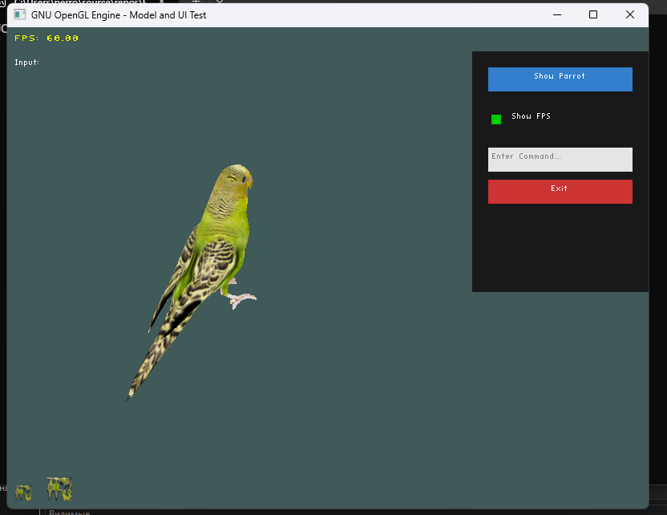

# PEngen: Простой OpenGL Движок для 3D и 2D Графики (C++)


## 🎯 Обзор Проекта

**PEngen** — это минималистичный и легковесный графический движок, написанный на C++ с использованием OpenGL 3.3+. Он предназначен для быстрого прототипирования и обучения основам 3D-графики, загрузки моделей, работы с освещением и создания простого 2D-интерфейса.
## version 0.0.2a
## ✨ Ключевые Возможности

* **3D Рендеринг:** Загрузка и отрисовка сложных моделей в формате OBJ с помощью `tinyobjloader`.
* **Базовое Освещение:** Реализация точечных источников света (Point Light) и шейдеров освещения.
* **Текстурирование:** Поддержка загрузки текстур (PNG/JPG) с использованием `stb_image`.
* **Система UI:** Простой 2D-интерфейс (Кнопки, Чекбоксы, Поля ввода) с отрисовкой текста через `stb_easy_font`.
* **Математика:** Использование библиотеки `GLM` для матриц, векторов и кватернионов.

## 🖼️ Скриншот и Видео

### Скриншот Работы Движка

*Пример: 3D-модель Viking Room, точечный источник света, и функциональный 2D-интерфейс в правом верхнем углу.*



### Демонстрационное Видео

Посмотрите, как работает PENgen в действии, включая интерактивное управление UI и перемещение источника света.
<video src="https://samplelib.com/lib/preview/mp4/sample-5s.mp4" width="320" height="240" controls></video>

---

## 🛠️ Документация PEngen: Как Пользоваться
Наш движок основан на **OpenGL** и **GLFW** и предоставляет разработчику набор инструментов для создания интерактивных 3D-сцен и пользовательских интерфейсов. Все основные структуры и функции находятся в пространстве имен `gnu` и `gnu::UI`.

## 1. 🛠️ Основы Движка и Инициализация

### Инициализация Главного Окна
Для запуска приложения используется функция, которая настраивает OpenGL контекст, инициализирует GLFW и создает графическое окно.

| Функция | Описание |
| :--- | :--- |
| `GLFWwindow* Init_OpenGL_Window(int width, int height, const std::string& title)` | Создает окно с заданными размерами (`width`, `height`) и заголовком (`title`). |

### Шейдеры
Шейдеры компилируются и линкуются в объекты `ShaderProgram`.

| Структура | Описание |
| :--- | :--- |
| `struct ShaderProgram` | Контейнер для идентификатора программы шейдеров (`GLuint programID`). |
| `ShaderProgram Compile_and_Link_Shader(const std::string& vertexPath, const std::string& fragmentPath)` | Компилирует шейдеры из указанных файлов и линкует их в готовую программу. |

---

## 2. 🌍 3D-Графика и Управление Сценой

Ядром 3D-рендеринга являются структуры **Mesh** и **Model**, а также система трансформации (перемещение, вращение, масштабирование).


### Структуры 3D-Объектов

| Структура | Описание | Основные поля |
| :--- | :--- | :--- |
| `struct Vertex` | Представляет одну вершину. | `position` (`glm::vec3`), `normal` (`glm::vec3`), `texCoords` (`glm::vec2`). |
| `struct Mesh` | Единица рендеринга. Хранит буферы геометрии (`VAO`, `VBO`, `IBO`) и параметры рендеринга. | `position`, `rotation` (`glm::quat`), `scale`, `textureID`, `baseColor`. |
| `struct Model` | Коллекция мешей. Используется для загрузки моделей из файлов. | `std::vector<Mesh> meshes`, `model_position`. |

### Функции Управления 3D-Моделями

| Функция | Описание |
| :--- | :--- |
| `Model Load_Model_From_File_OBJ(const std::string& filePath, const std::string& baseDir)` | Загружает модель из файла формата **OBJ**. |
| `Model Create_Cube_Model()` | Создает простую модель куба (например, для визуализации источника света). |
| `void Draw_Model(const Model& model, const ShaderProgram& shader, const glm::mat4& viewProjection)` | Отрисовывает модель, используя указанный шейдер и объединенную матрицу `View * Projection`. |
| `glm::mat4 Mesh::get_transform() const` | Возвращает матрицу `Model` (трансформации) для меша. |

---

## 3. 💡 Освещение

Движок поддерживает один **точечный источник света** (`Point Light`).

| Структура | Описание |
| :--- | :--- |
| `struct LightSource` | Описывает источник света. |
| `LightSource Create_Light_Source(const glm::vec3& position, const glm::vec3& color, float intensity)` | Утилита для создания объекта света. |

### Управление Освещением
Позицией света можно управлять непосредственно из приложения с помощью следующих клавиш:
| Клавиша | Действие |
| :--- | :--- |
| **NumPad +** | Перемещение света вверх (**Y+**) |
| **NumPad 1** | Перемещение света влево (**X-**) |
| **NumPad 2** | Перемещение света вправо (**X+**) |

---

## 4. 🎮 Управление Камерой (FPS-Стиль)

Камера управляется в стиле шутера от первого лица и привязана к системе времени (`deltaTime`) для стабильной скорости движения.


### Параметры Камеры (в `GameState`)
| Параметр | Тип | Назначение |
| :--- | :--- | :--- |
| `cameraPos` | `glm::vec3` | Текущая позиция камеры. Начальная: `(5.0f, 5.0f, 5.0f)`. |
| `cameraFront` | `glm::vec3` | Вектор направления, куда смотрит камера. |
| `cameraYaw` | `float` | Угол поворота вокруг оси Y (рыскание). |
| `cameraPitch` | `float` | Угол наклона (тангаж). Начальный: `-40.0f` (для обзора сцены). |
| `cameraSpeed` | `float` | Скорость движения (единиц в секунду). |

### Схема Управления
| Ввод | Действие |
| :--- | :--- |
| **W, A, S, D** | **Перемещение** камеры вперед, влево, назад, вправо. |
| **Правая Кнопка Мыши (удерживать)** | **Вращение** камеры (изменение углов Yaw/Pitch). Курсор скрывается при удержании. |
| **ESC (двойное нажатие)** | Выход из приложения. |

---

## 5. 🖥️ Пользовательский Интерфейс (UI)

Все элементы 2D-интерфейса находятся в пространстве имен `gnu::UI` и отрисовываются с помощью ортографической проекции. Координаты UI — это **пиксели** (Y=0 — верх экрана).

### Базовый Элемент
| Структура | Описание | Основные поля |
| :--- | :--- | :--- |
| `struct UIQuad` | Базовый класс для всех 2D-элементов. | `position` (`glm::vec2`), `size` (`glm::vec2`), `color` (`glm::vec3`), `mesh` (`Mesh`). |

### Интерактивные Элементы

| Структура | Наследует от | Описание | Принцип работы |
| :--- | :--- | :--- | :--- |
| `Button` | `UIQuad` | Кликабельная кнопка с текстом. | Срабатывает один раз при **нажатии** (GLFW\_PRESS). |
| `Checkbox` | `UIQuad` | Элемент выбора с текстом. | Состояние `isChecked` переключается при **нажатии**. |
| `InputField` | `UIQuad` | Поле для ввода текста. | Активируется кликом или нажатием **T**. Поддерживает ввод символов и **Backspace**. |

### Функции UI-Рендеринга и Взаимодействия

| Функция | Назначение |
| :--- | :--- |
| `Mesh Create_Quad_Mesh()` | Создает общую геометрию 2D-квадрата для всех UI-элементов. |
| `void Draw_Button(...)` / `void Draw_Checkbox(...)` / `void Draw_InputField(...)` | Функции для отрисовки конкретных элементов UI. |
| `bool is_point_in_quad(float x, float y, const UIQuad& quad)` | Вспомогательная функция для проверки, находится ли курсор внутри области UI-квадрата. |
| `void print_string(float x, float y, const char* text, float r, float g, float b, float scale, bool center)` | Отрисовка текста (используется для FPS, отладки и текста на кнопках/полях ввода). |

### Особенности InputField

* **Активация/Фокус**: Установка флага `isActive = true` при клике или нажатии **T**. Это позволяет принимать символьный ввод.
* **Символьный ввод**: Используется колбэк `character_callback` для добавления символов в строку `currentText`.
* **Удаление**: Клавиша **Backspace** удаляет последний символ с небольшой задержкой для удобства.
* **Отображение**: Если `currentText` пуст, отображается `hintText` серым цветом. При активном поле ввода к тексту добавляется мигающий курсор.
* **Деактивация**: Клик вне поля ввода или повторное нажатие **T** снимает фокус.
  ## main.cpp
  ```cpp
  // main.cpp

#include "gnu/OpenGL.h"
#include <cmath>
#include <glm/gtx/quaternion.hpp> 
#include <glm/gtc/constants.hpp> 
#include <iostream>
#include <vector>
#include <stdexcept>
#include <cstdio>

// Размеры экрана
const int SCREEN_WIDTH = 800;
const int SCREEN_HEIGHT = 600;

using namespace gnu;
using namespace gnu::UI; // Используем пространство имен UI

// --- ГЛОБАЛЬНЫЕ СОСТОЯНИЯ ДЛЯ UI И МОДЕЛЕЙ ---
struct GameState {
    LightSource mainLight;
    Model vikingModel;
    Model parrotModel;
    bool isParrotVisible = false; // Состояние для переключения модели
    bool showFPS = true;          // Состояние для чекбокса

    // Элементы UI
    Button parrotButton;
    Button oqut;
    Checkbox fpsCheckbox;
    InputField inputField;

    // Управление ВВОДОМ
    float mouseX = 0.0f;
    float mouseY = 0.0f;
    bool isCtrlPressed = false;   // Для двойного выхода
    double lastKeyTime = 0.0;     // Для двойного выхода

    // ⭐️ КАМЕРА (FPS-Стиль) ⭐️
    glm::vec3 cameraPos = glm::vec3(5.0f, 5.0f, 5.0f); // Начальная позиция
    glm::vec3 cameraFront = glm::vec3(0.0f, 0.0f, -1.0f); // Вектор "Вперед"
    glm::vec3 cameraUp = glm::vec3(0.0f, 1.0f, 0.0f); // Вектор "Вверх"

    float cameraYaw = -135.0f; // Начальный поворот 
    float cameraPitch = -40.0f; // ⭐️ ИЗМЕНЕНО: Наклон для более полного обзора сцены ⭐️
    float cameraSpeed = 10.0f; // Скорость движения (единиц в секунду)

    // Управление мышью для вращения
    double lastMouseX = (double)SCREEN_WIDTH / 2.0;
    double lastMouseY = (double)SCREEN_HEIGHT / 2.0;
    bool firstMouse = true;
    bool isRMBPressed = false; // ⭐️ ИЗМЕНЕНО: Состояние правой кнопки мыши для вращения ⭐️
    float mouseSensitivity = 0.1f;

    // Время кадра для движения
    double lastFrameTime = 0.0;
};

// КОЛБЭК ДЛЯ ОБРАБОТКИ КЛАВИАТУРЫ
void key_callback(GLFWwindow* window, int key, int scancode, int action, int mods)
{
    GameState* state = static_cast<GameState*>(glfwGetWindowUserPointer(window));

    if (!state) return;

    if (action == GLFW_PRESS)
    {
        float move_speed = 1.0f;
        double currentTime = glfwGetTime();

        // 1. УПРАВЛЕНИЕ СВЕТОМ 
        switch (key) {
        case GLFW_KEY_KP_ADD: // Клавиша '+' на numpad (Y+)
            state->mainLight.position.y += move_speed;
            break;
        case GLFW_KEY_1: // X-
            state->mainLight.position.x -= move_speed;
            break;
        case GLFW_KEY_2: // X+
            state->mainLight.position.x += move_speed;
            break;
        }

        // 2. ДВОЙНОЕ НАЖАТИЕ ESCAPE ДЛЯ ВЫХОДА
        if (key == GLFW_KEY_ESCAPE) {
            if (currentTime - state->lastKeyTime < 0.3) { // 300 мс
                glfwSetWindowShouldClose(window, GLFW_TRUE);
            }
            state->lastKeyTime = currentTime;
        }

        // 3. ПЕРЕКЛЮЧЕНИЕ ФОКУСА ДЛЯ ПОЛЯ ВВОДА (например, клавишей 'T')
        if (key == GLFW_KEY_T) {
            state->inputField.isActive = !state->inputField.isActive;
            // При снятии фокуса очищаем поле
            if (!state->inputField.isActive) {
                std::cout << "Input Field Result: " << state->inputField.currentText << std::endl;
            }
        }
    }
}
bool exit_requested = false;

// КОЛБЭК: ОБРАБОТКА МЫШИ (КЛИКИ)
void mouse_button_callback(GLFWwindow* window, int button, int action, int mods) {
    GameState* state = static_cast<GameState*>(glfwGetWindowUserPointer(window));
    if (!state) return;

    float x = state->mouseX;
    float y = state->mouseY;

    // Проверка UI кликов
    bool ui_clicked = false;

    // ⭐️ ЛОГИКА UI (только по нажатию GLFW_PRESS, чтобы избежать двойного срабатывания/отмены) ⭐️
    if (action == GLFW_PRESS)
    {
        // 1. КНОПКА PARROT
        if (is_point_in_quad(x, y, state->parrotButton)) {
            state->isParrotVisible = !state->isParrotVisible;
            state->parrotButton.text = state->isParrotVisible ? "Hide Parrot" : "Show Parrot";
            std::cout << "Button Clicked: Parrot is now " << (state->isParrotVisible ? "VISIBLE" : "HIDDEN") << std::endl;
            ui_clicked = true;
        }
        // 2. КНОПКА EXIT
        else if (is_point_in_quad(x, y, state->oqut)) {
            exit_requested = true;
            ui_clicked = true;
        }
        // 3. ЧЕКБОКС
        else if (is_point_in_quad(x, y, state->fpsCheckbox)) {
            state->showFPS = !state->fpsCheckbox.isChecked;
            state->fpsCheckbox.isChecked = state->showFPS;
            std::cout << "Checkbox Clicked: Show FPS is now " << (state->showFPS ? "ON" : "OFF") << std::endl;
            ui_clicked = true;
        }

        // 4. ПОЛЕ ВВОДА
        if (is_point_in_quad(x, y, state->inputField)) {
            state->inputField.isActive = true;
            ui_clicked = true;
        }
        else {
            // Снимаем фокус, если кликнули вне поля
            if (state->inputField.isActive) {
                std::cout << "Input Field Result: " << state->inputField.currentText << std::endl;
            }
            state->inputField.isActive = false;
        }
    } // Конец if (action == GLFW_PRESS)

    // ⭐️ УПРАВЛЕНИЕ КАМЕРОЙ ПРАВОЙ КНОПКОЙ МЫШИ (RMB) ⭐️
    if (button == GLFW_MOUSE_BUTTON_RIGHT) { // ⭐️ ИЗМЕНЕНО НА RMB ⭐️
        if (action == GLFW_PRESS && !ui_clicked) {
            state->isRMBPressed = true;
            // Скрываем курсор, пока вращаем
            glfwSetInputMode(window, GLFW_CURSOR, GLFW_CURSOR_DISABLED);
        }
        else if (action == GLFW_RELEASE) {
            state->isRMBPressed = false;
            state->firstMouse = true; // Сбрасываем флаг, чтобы избежать скачка
            // Показываем курсор, когда отпустили
            glfwSetInputMode(window, GLFW_CURSOR, GLFW_CURSOR_NORMAL);

            // Также, если отпускаем кнопку, и поле ввода не активно, ставим курсор в режим нормального
            if (!state->inputField.isActive) {
                glfwSetInputMode(window, GLFW_CURSOR, GLFW_CURSOR_NORMAL);
            }
        }
    }
}

// КОЛБЭК: ОТСЛЕЖИВАНИЕ МЫШИ (ДЛЯ НАВЕДЕНИЯ И ВРАЩЕНИЯ КАМЕРЫ)
void cursor_position_callback(GLFWwindow* window, double xpos, double ypos) {
    GameState* state = static_cast<GameState*>(glfwGetWindowUserPointer(window));
    if (!state) return;

    state->mouseX = (float)xpos;
    state->mouseY = (float)ypos;

    // Проверяем наведение для кнопки (UI logic)
    state->parrotButton.isHovered = is_point_in_quad(state->mouseX, state->mouseY, state->parrotButton);

    // ⭐️ ЛОГИКА ВРАЩЕНИЯ КАМЕРЫ (только если RMB нажата) ⭐️
    if (state->isRMBPressed && !state->inputField.isActive) {
        if (state->firstMouse) {
            state->lastMouseX = xpos;
            state->lastMouseY = ypos;
            state->firstMouse = false;
        }

        float xoffset = (float)(xpos - state->lastMouseX);
        float yoffset = (float)(state->lastMouseY - ypos); // Инвертировано (Y-координаты экрана инвертированы)

        state->lastMouseX = xpos;
        state->lastMouseY = ypos;

        xoffset *= state->mouseSensitivity;
        yoffset *= state->mouseSensitivity;

        state->cameraYaw += xoffset;
        state->cameraPitch += yoffset;

        // Ограничение Pitch (нельзя перевернуться)
        if (state->cameraPitch > 89.0f) state->cameraPitch = 89.0f;
        if (state->cameraPitch < -89.0f) state->cameraPitch = -89.0f;

        // Обновление вектора cameraFront
        glm::vec3 front;
        front.x = cos(glm::radians(state->cameraYaw)) * cos(glm::radians(state->cameraPitch));
        front.y = sin(glm::radians(state->cameraPitch));
        front.z = sin(glm::radians(state->cameraYaw)) * cos(glm::radians(state->cameraPitch));
        state->cameraFront = glm::normalize(front);
    }
}

// КОЛБЭК: ОБРАБОТКА ВВОДА СИМВОЛОВ (ДЛЯ ПОЛЯ ВВОДА)
void character_callback(GLFWwindow* window, unsigned int codepoint) {
    GameState* state = static_cast<GameState*>(glfwGetWindowUserPointer(window));
    if (!state || !state->inputField.isActive) return;

    // Простая обработка: только печатаемые символы
    if (codepoint >= 32 && codepoint <= 126) {
        state->inputField.currentText += (char)codepoint;
    }
}

// КОЛБЭК: BACKSPACE
void process_backspace(GLFWwindow* window) {
    GameState* state = static_cast<GameState*>(glfwGetWindowUserPointer(window));
    if (!state || !state->inputField.isActive) return;

    // Добавляем задержку
    static double last_delete_time = 0.0;
    double current_time = glfwGetTime();

    if (current_time - last_delete_time > 0.1) {
        if (!state->inputField.currentText.empty()) {
            state->inputField.currentText.pop_back();
            last_delete_time = current_time;
        }
    }
}


int main() {
    // --- 1. ИНИЦИАЛИЗАЦИЯ СИСТЕМЫ ---
    GLFWwindow* window = Init_OpenGL_Window(SCREEN_WIDTH, SCREEN_HEIGHT, "GNU OpenGL Engine - Model and UI Test");
    if (!window) return -1;

    glEnable(GL_DEPTH_TEST);
    glEnable(GL_CULL_FACE);
    glCullFace(GL_BACK);
    glFrontFace(GL_CCW);

    // --- ИГРОВОЕ СОСТОЯНИЕ ---
    GameState state;
    state.mainLight = Create_Light_Source(glm::vec3(0.0f, 5.0f, 0.0f), glm::vec3(1.0f, 1.0f, 1.0f), 5.0f);
    glfwSetWindowUserPointer(window, &state);

    // --- УСТАНОВКА КОЛБЭКОВ ---
    glfwSetKeyCallback(window, key_callback);
    glfwSetCursorPosCallback(window, cursor_position_callback); // Теперь обрабатывает и вращение
    glfwSetMouseButtonCallback(window, mouse_button_callback);
    glfwSetCharCallback(window, character_callback);


    // --- 2. ПОДГОТОВКА ШЕЙДЕРОВ ---
    ShaderProgram modelShader = Compile_and_Link_Shader("simple.vert", "simple.frag");
    if (modelShader.programID == 0) return -1;

    ShaderProgram uiShader = Compile_and_Link_Shader("simple.vert", "simple.frag");
    if (uiShader.programID == 0) return -1;

    ShaderProgram textShader = Compile_and_Link_Shader("text.vert", "text.frag");
    if (textShader.programID == 0) return -1;

    // -------------------------------------------------------------------
    // 3. ЗАГРУЗКА 3D-МОДЕЛЕЙ 
    // -------------------------------------------------------------------
    try {
        state.vikingModel = Load_Model_From_File_OBJ("PEngen\\models\\viking_room.obj", "PEngen\\models\\");
        state.parrotModel = Load_Model_From_File_OBJ("PEngen\\models\\viking_room.obj", "PEngen\\models\\");

        std::cout << "SUCCESS: Loaded both models (Viking and Parrot stub)." << std::endl;
    }
    catch (const std::exception& e) {
        std::cerr << "Model loading failed: " << e.what() << std::endl;
        return -1;
    }

    // Инициализация текстуры
    GLuint customTextureID = Load_Texture_From_File("PEngen\\textures\\viking_room.png");
    if (customTextureID != 0) {
        for (auto& mesh : state.vikingModel.meshes) mesh.textureID = customTextureID;
        for (auto& mesh : state.parrotModel.meshes) mesh.textureID = customTextureID;
    }
    else {
        std::cerr << "WARNING: Custom texture failed to load. Drawing white/diffuse color." << std::endl;
    }

    // Настройка масштаба/позиции моделей
    for (auto& mesh : state.vikingModel.meshes) mesh.scale = glm::vec3(0.02f);
    for (auto& mesh : state.parrotModel.meshes) mesh.scale = glm::vec3(0.05f);
    for (auto& mesh : state.parrotModel.meshes) mesh.position = glm::vec3(2.0f, 0.0f, 0.0f);

    Model lightBulbModel = Create_Cube_Model();

    // -------------------------------------------------------------------
    // ⭐️ ИНИЦИАЛИЗАЦИЯ UI-ЭЛЕМЕНТОВ ⭐️
    Mesh quadMesh = Create_Quad_Mesh(); // Базовая геометрия для всех UI-квадов

    // 1. Заднее поле меню (Panel)
    UI::Panel uiBackground;
    uiBackground.mesh = quadMesh;
    uiBackground.position = glm::vec2(580.0f, 30.0f);
    uiBackground.size = glm::vec2(220.0f, 300.0f);
    uiBackground.color = glm::vec3(0.1f, 0.1f, 0.1f);
    uiBackground.layer = 10.0f;

    // 2. Небольшое изображение (Image 20x20)
    UI::Image uiSmallImage;
    uiSmallImage.mesh = quadMesh;
    uiSmallImage.position = glm::vec2(10.0f, SCREEN_HEIGHT - 30.0f);
    uiSmallImage.size = glm::vec2(20.0f, 20.0f);
    uiSmallImage.textureID = customTextureID;
    uiSmallImage.color = glm::vec3(1.0f, 1.0f, 1.0f);
    uiSmallImage.layer = 20.0f;

    // 3. ДОПОЛНИТЕЛЬНОЕ ИЗОБРАЖЕНИЕ СНИЗУ (Image 30x30)
    UI::Image uiBottomImage;
    uiBottomImage.mesh = quadMesh;
    uiBottomImage.position = glm::vec2(50.0f, SCREEN_HEIGHT - 40.0f);
    uiBottomImage.size = glm::vec2(30.0f, 30.0f);
    uiBottomImage.textureID = customTextureID;
    uiBottomImage.color = glm::vec3(1.0f, 0.5f, 0.5f);
    uiBottomImage.layer = 20.0f;

    // 4. Кнопка "Parrot"
    state.parrotButton.mesh = quadMesh;
    state.parrotButton.position = glm::vec2(600.0f, 50.0f);
    state.parrotButton.size = glm::vec2(180.0f, 30.0f);
    state.parrotButton.text = state.isParrotVisible ? "Hide Parrot" : "Show Parrot";
    state.parrotButton.color = glm::vec3(0.2f, 0.5f, 0.8f);
    state.parrotButton.textColor = glm::vec3(1.0f, 1.0f, 1.0f);

    // 5. Кнопка "Exit"
    state.oqut.mesh = quadMesh;
    state.oqut.position = glm::vec2(600.0f, 190.0f);
    state.oqut.size = glm::vec2(180.0f, 30.0f);
    state.oqut.text = "Exit";
    state.oqut.color = glm::vec3(0.8f, 0.2f, 0.2f);
    state.oqut.textColor = glm::vec3(1.0f, 1.0f, 1.0f);

    // 6. Чекбокс
    state.fpsCheckbox.mesh = quadMesh;
    state.fpsCheckbox.position = glm::vec2(600.0f, 100.0f);
    state.fpsCheckbox.size = glm::vec2(180.0f, 30.0f);
    state.fpsCheckbox.boxSize = glm::vec2(20.0f, 20.0f);
    state.fpsCheckbox.isChecked = state.showFPS;
    state.fpsCheckbox.text = "Show FPS";

    // 7. Поле ввода
    state.inputField.mesh = quadMesh;
    state.inputField.position = glm::vec2(600.0f, 150.0f);
    state.inputField.size = glm::vec2(180.0f, 30.0f);
    state.inputField.hintText = "Enter Command...";
    state.inputField.textColor = glm::vec3(0.0f, 0.0f, 0.0f);
    // -------------------------------------------------------------------

    // --- 4. НАСТРОЙКА МАТРИЦ (Инициализация) ---
    // Матрица Проекции (остается фиксированной)
    glm::mat4 projection = glm::perspective(glm::radians(45.0f), (float)SCREEN_WIDTH / (float)SCREEN_HEIGHT, 0.1f, 100.0f);
    // Матрицы View и ViewProjection будут обновляться в цикле
    glm::mat4 view = glm::mat4(1.0f);
    glm::mat4 viewProjection = glm::mat4(1.0f);

    // МАТРИЦА UI: Y=0 СВЕРХУ 
    glm::mat4 orthoMatrix = glm::ortho(0.0f, (float)SCREEN_WIDTH, (float)SCREEN_HEIGHT, 0.0f);
    GLint orthoLoc = glGetUniformLocation(textShader.programID, "orthoMatrix");
    GLint colorLoc = glGetUniformLocation(textShader.programID, "textColor");

    // 4.5. НАСТРОЙКА ИСТОЧНИКА СВЕТА 
    GLint lightPosLoc = glGetUniformLocation(modelShader.programID, "lightPos");
    GLint lightColorLoc = glGetUniformLocation(modelShader.programID, "lightColor");
    GLint viewPosLoc = glGetUniformLocation(modelShader.programID, "viewPos");


    // --- 5. FPS ПЕРЕМЕННЫЕ ---
    double lastTime = glfwGetTime(); // Используется для расчета FPS
    int frameCount = 0;
    char fpsBuffer[32] = "FPS: ...";
    char inputBuffer[100];

    // Устанавливаем начальное время кадра
    state.lastFrameTime = lastTime;

    // --- 6. ОСНОВНОЙ ЦИКЛ РЕНДЕРИНГА ---
    while (!glfwWindowShouldClose(window) && !exit_requested) {
        // ... (FPS & DeltaTime Logic)
        double currentTime = glfwGetTime();
        // ⭐️ Расчет DeltaTime ⭐️
        float deltaTime = (float)(currentTime - state.lastFrameTime);
        state.lastFrameTime = currentTime;

        frameCount++;
        if (currentTime - lastTime >= 1.0) {
            double fps = (double)frameCount / (currentTime - lastTime);
            std::snprintf(fpsBuffer, sizeof(fpsBuffer), "FPS: %.2f", fps);
            frameCount = 0;
            lastTime = currentTime;
        }

        glfwPollEvents();
        glClearColor(0.25f, 0.35f, 0.35f, 1.0f);
        glClear(GL_COLOR_BUFFER_BIT | GL_DEPTH_BUFFER_BIT);

        // --- ОБРАБОТКА ВВОДА ---
        if (glfwGetKey(window, GLFW_KEY_BACKSPACE) == GLFW_PRESS) {
            process_backspace(window);
        }

        // -------------------------------------------------------------------
        // ⭐️ 7. ОБНОВЛЕНИЕ КАМЕРЫ И МАТРИЦ ⭐️
        // -------------------------------------------------------------------

        // 7.1. ОБРАБОТКА WASD ДВИЖЕНИЯ
        float cameraSpeed = state.cameraSpeed * deltaTime;

        // Вектор "Вправо"
        glm::vec3 cameraRight = glm::normalize(glm::cross(state.cameraFront, state.cameraUp));

        if (glfwGetKey(window, GLFW_KEY_W) == GLFW_PRESS)
            state.cameraPos += cameraSpeed * state.cameraFront;
        if (glfwGetKey(window, GLFW_KEY_S) == GLFW_PRESS)
            state.cameraPos -= cameraSpeed * state.cameraFront;
        if (glfwGetKey(window, GLFW_KEY_A) == GLFW_PRESS)
            state.cameraPos -= cameraSpeed * cameraRight;
        if (glfwGetKey(window, GLFW_KEY_D) == GLFW_PRESS)
            state.cameraPos += cameraSpeed * cameraRight;

        // 7.2. ОБНОВЛЕНИЕ МАТРИЦ
        // Матрица View: Eye Position, Target Position, Up Vector
        view = glm::lookAt(state.cameraPos, state.cameraPos + state.cameraFront, state.cameraUp);
        viewProjection = projection * view;


        // --- ЛОГИКА ВРАЩЕНИЯ МОДЕЛИ ---
        float time = (float)currentTime; // Используем текущее время
        glm::quat total_rotation = glm::angleAxis(time * glm::radians(30.0f), glm::vec3(0.0f, 1.0f, 0.0f));

        for (auto& mesh : state.vikingModel.meshes) {
            mesh.rotation = total_rotation;
            mesh.position = glm::vec3(0.0f, -1.0f, 0.0f);
        }
        for (auto& mesh : state.parrotModel.meshes) {
            mesh.rotation = total_rotation;
        }

        // ОБНОВЛЕНИЕ ТРАНСФОРМАЦИИ ОБЪЕКТА СВЕТА 
        if (!lightBulbModel.meshes.empty()) {
            lightBulbModel.meshes[0].position = state.mainLight.position;
        }

        // -------------------------------------------------------------------
        // --- 8. ОТРЕНДЕРИТЬ МОДЕЛЬ (3D) С ОСВЕЩЕНИЕМ ---
        // -------------------------------------------------------------------
        glEnable(GL_DEPTH_TEST);
        glEnable(GL_CULL_FACE);

        glUseProgram(modelShader.programID);

        // ОТПРАВКА UNIFORM-ПЕРЕМЕННЫХ ДЛЯ ОСВЕЩЕНИЯ
        if (lightPosLoc != -1) glUniform3f(lightPosLoc, state.mainLight.position.x, state.mainLight.position.y, state.mainLight.position.z);
        if (lightColorLoc != -1) glUniform3f(lightColorLoc, state.mainLight.color.x * state.mainLight.intensity, state.mainLight.color.y * state.mainLight.intensity, state.mainLight.color.z * state.mainLight.intensity);
        // ОТПРАВКА НОВОЙ ПОЗИЦИИ КАМЕРЫ В ШЕЙДЕР 
        if (viewPosLoc != -1) glUniform3f(viewPosLoc, state.cameraPos.x, state.cameraPos.y, state.cameraPos.z);

        Draw_Model(state.vikingModel, modelShader, viewProjection);
        if (state.isParrotVisible) {
            Draw_Model(state.parrotModel, modelShader, viewProjection);
        }

        // ОТРЕНДЕРИТЬ ЛАМПОЧКУ
        if (!lightBulbModel.meshes.empty()) {
            Draw_Mesh(lightBulbModel.meshes[0], modelShader, viewProjection);
        }

        glUseProgram(0);


        // -------------------------------------------------------------------
        // --- 9. ОТРЕНДЕРИТЬ UI ЭЛЕМЕНТЫ И ТЕКСТ (2D) ---
        // -------------------------------------------------------------------
        glDisable(GL_DEPTH_TEST);
        glDisable(GL_CULL_FACE);
        glEnable(GL_BLEND);
        glBlendFunc(GL_SRC_ALPHA, GL_ONE_MINUS_SRC_ALPHA);

        if (uiShader.programID != 0 && textShader.programID != 0)
        {
            // Отрисовка заднего фона меню (Panel)
            UI::Draw_Panel(uiBackground, uiShader, orthoMatrix);

            // Отрисовка маленьких изображений снизу
            UI::Draw_Image(uiSmallImage, uiShader, orthoMatrix);
            UI::Draw_Image(uiBottomImage, uiShader, orthoMatrix);

            // Отрисовка интерактивных элементов (сверху фона)
            UI::Draw_Button(state.parrotButton, uiShader, textShader, orthoMatrix);
            UI::Draw_Button(state.oqut, uiShader, textShader, orthoMatrix);
            UI::Draw_Checkbox(state.fpsCheckbox, uiShader, textShader, orthoMatrix);
            UI::Draw_InputField(state.inputField, uiShader, textShader, orthoMatrix);


            glUseProgram(textShader.programID);
            if (orthoLoc != -1) glUniformMatrix4fv(orthoLoc, 1, GL_FALSE, &orthoMatrix[0][0]);

            // Вывод FPS
            if (state.showFPS) {
                float r = 1.0f, g = 1.0f, b = 0.0f;
                if (colorLoc != -1) glUniform3f(colorLoc, r, g, b);
                gnu::UI::print_string(10, 10, fpsBuffer, r, g, b, 1.5f, false);
            }

            // Вывод введенного текста (Для отладки)
            std::snprintf(inputBuffer, sizeof(inputBuffer), "Input: %s", state.inputField.currentText.c_str());
            glm::vec3 debug_text_color = glm::vec3(1.0f, 1.0f, 1.0f);
            if (colorLoc != -1) glUniform3f(colorLoc, debug_text_color.x, debug_text_color.y, debug_text_color.z);
            gnu::UI::print_string(10, 40, inputBuffer, debug_text_color.x, debug_text_color.y, debug_text_color.z, 1.0f, false);

            glUseProgram(0);
        }


        glDisable(GL_BLEND);
        glEnable(GL_DEPTH_TEST);
        glEnable(GL_CULL_FACE);
        // -------------------------------------------------------------------

        glfwSwapBuffers(window);
    }

    // --- 9. ОЧИСТКА РЕСУРСОВ ---
    if (customTextureID != 0) glDeleteTextures(1, &customTextureID);
    for (auto& mesh : state.vikingModel.meshes) mesh.delete_gpu_resources();
    for (auto& mesh : state.parrotModel.meshes) mesh.delete_gpu_resources();
    for (auto& mesh : lightBulbModel.meshes) mesh.delete_gpu_resources();

    // Очистка общей геометрии UI
    quadMesh.delete_gpu_resources();

    glDeleteProgram(modelShader.programID);
    glDeleteProgram(uiShader.programID);
    glDeleteProgram(textShader.programID);
    glfwDestroyWindow(window);
    glfwTerminate();

    return 0;
}
  ```
