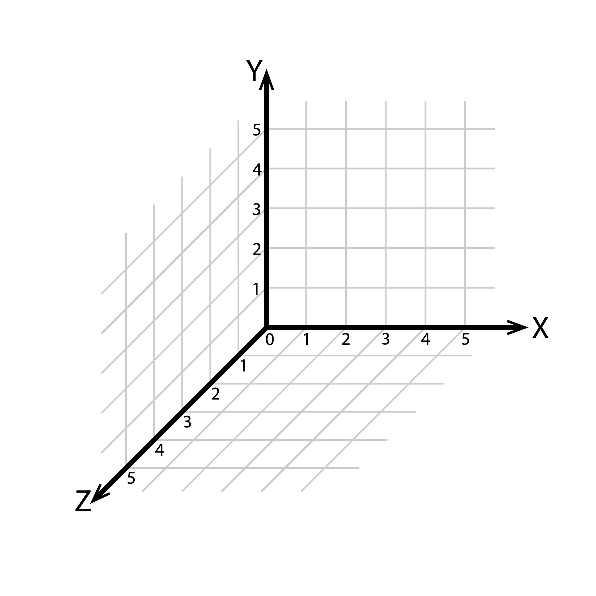

# 🚀 GNU OpenGL Engine (PEngen) Documentation

Hello! I'm pleased to present the complete documentation for the **GNU OpenGL Engine**, which I affectionately call **PEngen**!

| Parameter | Value |
| :--- | :--- |
| **Engine Name** | **GNU OpenGL Engine (PEngen)** |
| **Version** | **0.0.9a** |
| **Based** | C++, OpenGL (GLFW/GLAD), GLM |
| **Purpose** | This engine was created so that developers can **quickly and enjoyably** create working 3D scenes without getting bogged down in the OpenGL configuration nitty-gritty. PEngen provides ready-to-use tools for loading models, controlling the camera (FPS-style), and lighting. It also includes a simple yet powerful 2D UI and a (almost) cross-platform framework for input and audio!

Get ready to dive into the world of 3D graphics!

-----

## 🚀 1. Core Module (`Engine` and `Scene`)

### `PEngine::Vec` Structure (Math)

| Structure | Fields | Description |
| --- | --- | --- |
| **`Vec2`** | `float x, y` | Coordinates for 2D/UI. |
| **`Vec3`** | `float x, y, z` | Coordinates for 3D space and physics. |

### `PEngine::Engine` Class

The central class that manages the window and the application lifecycle.

* **`Engine(int width, int height, const std::string& title)`**: Initializes GLFW, creates a window, and sets up the context.
* **`bool ShouldClose()`**: Checks if the user has closed the window.
* **`void Update()`**: Clears buffers, updates input, and changes frames. Call at the end of each cycle.
* **`Scene* GetScene()`**: Provides access to world objects.
* **`~Engine()`**: **(Delete)** Closes the window and frees system resources. ### The `PEngine::Scene` class and the `Object` struct

A scene object (`Object`) is a container for rendering.

**`Object` fields:**

* `long long id`: Unique ID.
* `std::string name`: Name to search for.
* `Vec3 pos, size, rotator`: Transformation.
* `uint8_t state`: Type (1: Cube, 2: Model, 3: Button, 4: Checkbox, 5: Input, 6: Panel, 7: Image).
* `PEGLMaterial material`: Colors and textures.
* `PEGLModel model`: 3D mesh data.
* `void (*on_click)()`: Click event function.

**`Scene` Functions:**

* **`AddObject(const Object& object)`**: Adds an object to the world.
* **`SearchObject(const char* name)`**: Searches for an object by name.
* **`GetObjectById(long long id)`**: Searches for an object by ID.
* **`SetCamera(Vec3 position, float yaw, float pitch, float roll)`**: Controls the player's view.
* **`UpdateUI(GLFWwindow* window)`**: Handles interactions in the UI.
* **`Render()`**: Draws all scene contents.

---

## ⚛️ 2. Physics Module (`Physics.h`, `Physics_Base.h`)

Physics runs in parallel with the scene, updating the coordinates of visual objects.

### `PhysicsObject` structure

* `long long linked_object_id`: **Link!** ID of a visual object from `Scene`.
* `Vec3 pos, size, velocity, speed_gravity`: Movement and size parameters.
* `float mass`: Object mass.
* `uint8_t collision_type`: `0` - none, `1` - trigger, `2` - rigid body (bounce).
* `int friction`: Friction force.
* `void (*on_collision)(PhysicsObject& other)`: Collision event.

### `PEngine::Physics_Base` class

* **`Physics_Base(Scene* scene)`**: Constructor that links physics to the scene.
* **`AddPhysicsObject(const PhysicsObject& physics_object)`**: Registers a body in the simulation.
* **`SearchPhysicsObject(const char* name)`**: Finds a body by name.
* **`UpdatePhysics(float deltaTime)`**: Performs collision and displacement calculations.

---

## 🗑️ 3. Cleanup and Delete Module (`OpenGL.h`)

Functions for freeing up GPU memory.

* **`void PEGLDelete_Model(PEGLModel& model)`**: Deletes meshes, VAOs, VBOs, and EBOs. Call when the 3D model is no longer needed.
* **`void PEGLDelete_Shader_Program(PEGLShaderProgram& program)`**: Deletes the compiled shader.
* **`void PEAStopAll()`**: (from Audio) Stops all sounds and closes their handles.

---

## 🔊 4. Audio Module (`Audio.h`)

`AudioManager` class (all functions are static).

* **`PEAPlaySound(const std::string& filePath, int id)`**: Single playback.
* **`PEAPlayLoopedSound(const std::string& filePath, int id)`**: Background music (loop).
* **`PEAStopSound(int id)`**: Stop a specific sound by ID. * **`PEASetVolume(float volume, int id)`**: Set the volume (0.0 - 1.0).

---

## ⌨️ 5. Input Module (`Input.h`)

`InputManager` class for emulation and management.

* **`PEIKeyPress(WORD vkCode)`**: Press and release a key.
* **`PEIKeyDown(WORD vkCode)`**: Hold down a key.
* **`PEIKeyUp(WORD vkCode)`**: Release a key.
* **`PEIMouseClickL()` / `PEIMouseClickR()**`: Mouse clicks.
* **`PEIMouseMoveAbsolute(int x, int y)`**: Move the cursor to a point on the screen.

---

## 💾 6. Config and Log Module (`cfg.h`, `log.h`)

* **`void PEsave(const string& filePath, const string& data)`**: Saves text to the `PEngine\cfg\` folder.
* **`string PEload(const string& filePath)`**: Loads text from a file.
* **`void PElogger(const char* message)`**: Logs an important event to `log.txt`